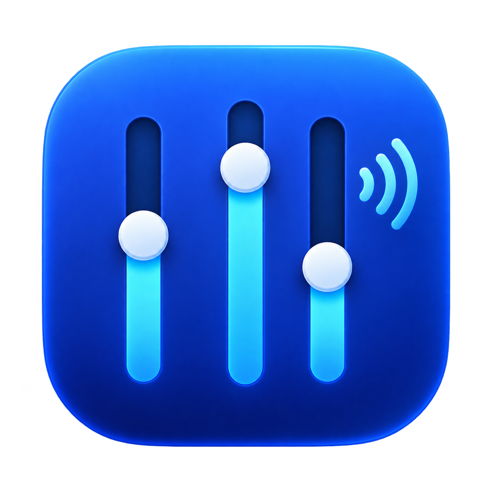

# AppVolume

AppVolume is a native macOS menu bar app for controlling individual applications' playback volume. It uses public Core Audio process taps. Captured audio stays in memory and is never saved or uploaded. The interface is in English.



## Install

Requires macOS 26 or later. The current build was tested on Apple Silicon with macOS 27.2. Download a ZIP from [Releases](https://github.com/ericchiu-ca/AppVolume/releases), extract `AppVolume.app`, and move it to Applications. Check the release notes for the package's actual signing and notarization status.

AppVolume starts with control paused. Lower the system volume and play a quiet test sound, then choose **Resume Control** in the menu bar panel. Allow System Audio Capture if macOS prompts. The app does not request microphone, camera, Accessibility, or Full Disk Access permission. Choose **Pause Control** to restore original playback.

Each app row's speaker button grows with its volume up to the original v0.1.0 icon size and shows more sound waves at higher levels. It remains a mute/unmute button; muting shows a small slashed speaker while retaining the saved volume.

## Build from source

Built with Xcode 27.2 and Swift 6.4:

```bash
swift test --disable-sandbox
./script/build_and_run.sh --verify
```

The local app is `dist/AppVolume.app`. The script stops only an instance running from that path, then builds, signs, and launches it. Its default signature is ad hoc; set `APPVOLUME_SIGNING_IDENTITY` to use an available local identity. A changed signature may cause macOS to request capture permission again.

The icon source is `Assets/AppIcon.png`; `Assets/AppIcon.icns` is included. Run `./script/create_icon.sh` to regenerate it. `script/package_release.sh` builds an optimized app under `dist/release`, signs it with a Developer ID certificate, and creates a ZIP. Set `APPVOLUME_NOTARY_PROFILE` to a locally stored `notarytool` Keychain profile to submit, staple, and repackage it. A ZIP is only notarized if all those steps succeed.

## Audio path

For each logical app: Core Audio process objects → a dedicated Process Tap → a private Aggregate Device combining the tap and default physical output → an 8 ms linear gain ramp in its IOProc → physical output. Each app has an independent tap and gain target. Moving a slider changes an atomic target without rebuilding the audio graph. The audio callback performs no file, network, logging, or UI work.

The tap uses `mutedWhenTapped`. According to the SDK, reading from the tap suppresses that app's original sound and stopping the read restores it. Normal pause and quit tear down AppVolume's audio resources.

## Limitations

- Only audio routed to the default output device is handled; explicitly routed audio is shown as bypassed.
- The physical output must have no input channels. The tap and aggregate output must share a sample rate and use two-channel, little-endian, packed Float32 PCM, interleaved or planar. Unsupported formats and devices are bypassed with original sound restored. A Bluetooth headset exposing input channels can be bypassed.
- Logical identity comes from the outermost `.app` bundle ID where possible, then the Core Audio process bundle ID. Unidentified processes get temporary rows without saved settings. Helper attribution for Firefox, Chrome, Steam games, and CrossOver/Wine needs individual testing.
- Core Audio reports output activity; a green dot separately indicates nonzero samples in the latest poll. Inactive rows remain for five seconds to avoid flicker. The panel grows with the app list and scrolls only when it exceeds screen height.
- Protected content, output switching, sleep and wake, force quit, recording, calls, and screen sharing remain unvalidated. AppVolume does not bypass content protection. Choose **Pause Control** if audio behaves unexpectedly.

## Verification

The development build compiled, six unit tests passed, and the app launched. User listening checks confirmed 100%, 50%, and 0% volume changes for one app; independent control of two apps; a saved 30% value after restart; and original volume after Pause Control and Quit. These are listening checks, not calibrated measurements. Output switching, sleep and wake, app relaunch, permission denial, force quit, and recording or call compatibility remain untested.

## Remove

Quit normally before removing `AppVolume.app`. To also clear settings, delete the `com.ericchiu.AppVolume` user defaults domain. Do not manually delete audio devices created by other software.

## Apple documentation

- [Capturing system audio with Core Audio taps](https://developer.apple.com/documentation/coreaudio/capturing-system-audio-with-core-audio-taps)
- [CATapDescription](https://developer.apple.com/documentation/coreaudio/catapdescription)
- [mutedWhenTapped](https://developer.apple.com/documentation/coreaudio/catapmutebehavior/mutedwhentapped)
- [NSAudioCaptureUsageDescription](https://developer.apple.com/documentation/bundleresources/information-property-list/nsaudiocaptureusagedescription)
- [Notarizing macOS software before distribution](https://developer.apple.com/documentation/security/notarizing-macos-software-before-distribution)

The implementation also checked installed SDK headers `AudioHardware.h`, `AudioHardwareTapping.h`, and `CATapDescription.h`. Process tap creation and destruction have been available since macOS 14.2; this project targets macOS 26.

No open-source license is currently granted for this repository.
